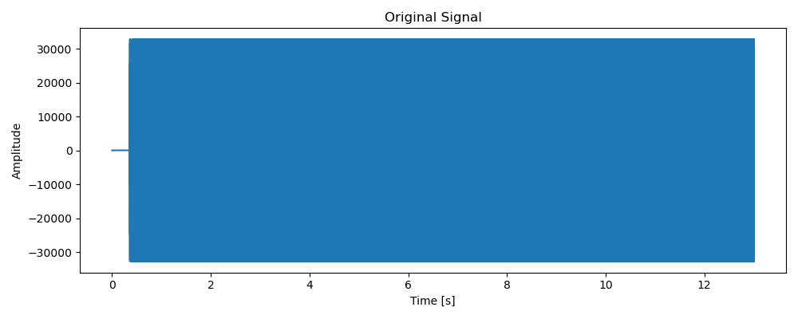
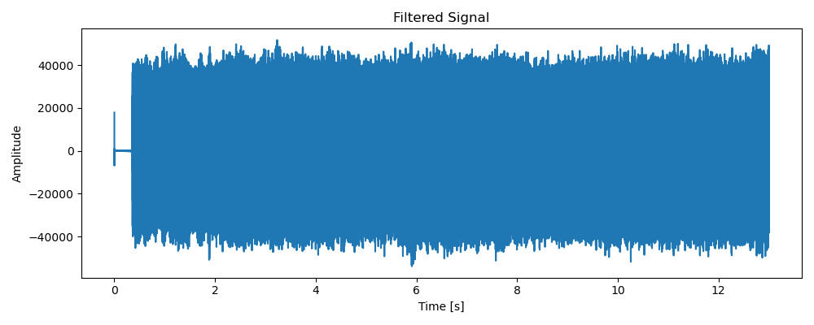
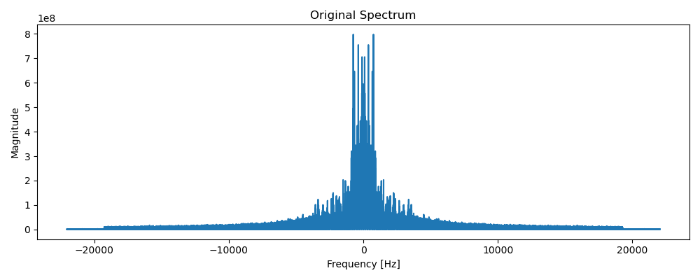
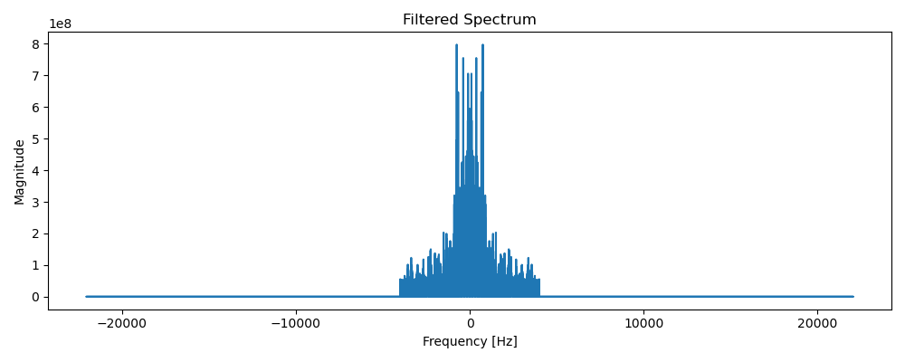

# 音频除噪系统设计与实现（基于傅里叶变换）

###### 2252088 孙少杰

## 一、项目目的

本项目旨在设计并实现一个音频信号除噪系统，能够针对背景噪声（如风声、电流声、机器噪声等）对语音或其他音频信号进行降噪处理，从而提升音频的清晰度和可理解性。

该系统基于傅里叶变换技术，将时域音频信号转换到频域，分析其频谱特性，并通过滤波器去除特定频段的噪声信号，再经逆傅里叶变换恢复为时域信号，实现降噪目的。

## 二、实现原理

音频信号中通常既包含有用信号（如语音），也包含噪声（如风声、电流声、机械噪声等）。它们往往在频域中表现为不同频率范围的能量分布。例如，语音信号主要集中在 300Hz~3400Hz 范围，而噪声可能集中在更高或更低频率上。

本项目通过傅里叶变换将音频从时域转换到频域，使混合信号中的各个频率成分得以清晰展现。在频域中，我们可以观察到哪些频段的幅度值异常（通常是噪声造成的），从而通过设计频率滤波器（如低通、带阻等）选择性地保留或抑制某些频率段。

本系统采用低通滤波器，即保留低于设定截止频率（如 4000Hz）内的频率分量，屏蔽高频噪声。其核心操作是：将频谱中高于截止频率的部分置零，从而抑制噪声。

完成频域滤波后，再使用逆傅里叶变换（IFFT）将信号还原回时域，此时得到的波形即为去噪后的音频信号。

这种方式之所以有效，是因为：
1. 噪声与信号频段分离性强；
2. 频域操作能准确抑制指定频段成分；
3. 傅里叶变换是线性变换，便于分量级处理和复原。

因此，傅里叶变换在语音增强与降噪领域是一种简洁而有效的处理工具。

## 三、实现步骤

1.	读取原始音频（.wav 文件）
2.	使用 scipy.fft 对音频做傅里叶变换
3.	分析频谱特征，设计低通滤波器
4.	将滤波器作用于频谱，实现频域滤波
5.	逆变换回时域信号
6.	保存去噪后的音频
7.	画出波形图、频谱图用于对比分析

## 四、关键代码

以下为项目主代码核心段落（节选）：

```python
spectrum = fft(data)
freqs = fftfreq(len(data), 1 / rate)

# 低通滤波
cutoff = 4000  # Hz
filtered_spectrum = np.copy(spectrum)
filtered_spectrum[np.abs(freqs) > cutoff] = 0

# 逆傅里叶变换
filtered_signal = np.real(ifft(filtered_spectrum))
filtered_signal = np.int16(filtered_signal / np.max(np.abs(filtered_signal)) * 32767)
wavfile.write("output.wav", rate, filtered_signal)
```
## 五、效果图

##### 5.1 原始音频波形图



##### 5.2 去噪后音频波形图



##### 5.3 原始频谱图



##### 5.4 去噪后频谱图



##### 5.5 原始 vs 去噪波形对比图


### 解释：

1. 原始波形图中可以看到明显的高频抖动、密集的噪声波形。
2. 去噪波形图则更加平滑，非结构性噪声减少。
3. 频谱图对比显示高于 4kHz 的频率被大幅削弱，目标频段保留。


## 六、项目心得与总结

傅里叶变换是处理周期和频率类噪声的有效工具，尤其适合静态背景噪声。
在频域进行滤波比在时域做卷积更加直观、计算更快。
若音频中噪声频段与目标信号频段重叠，则需更复杂的算法（如谱减法或神经网络降噪）。

